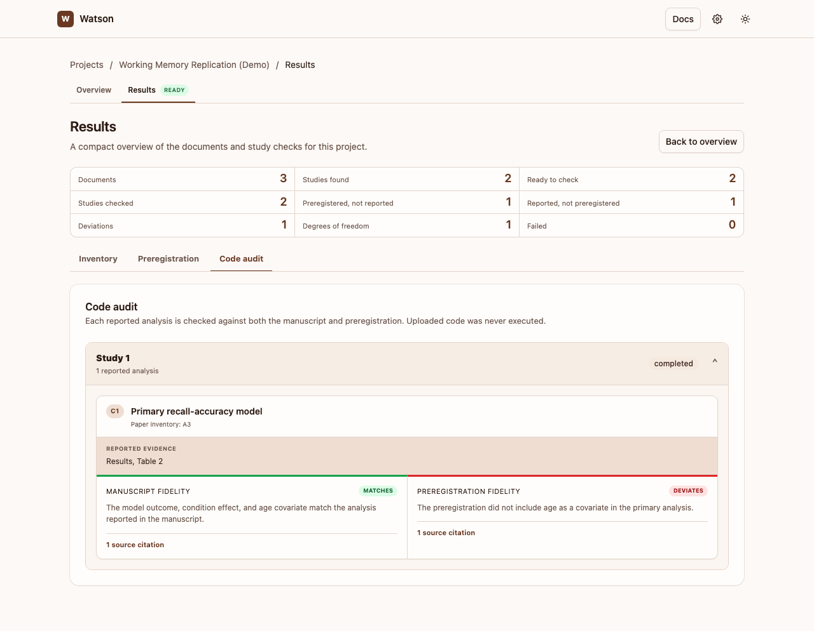

# Code audit

Watson's optional code audit reviews uploaded analysis source against the analyses reported in the manuscript and the matched preregistration. It is a source review: Watson never executes uploaded code and never reads raw data.

## What it checks

For each reported analysis in a study, Watson gives two separate assessments:

1. **Matches the manuscript** — whether the cited source code supports what the paper reports.
2. **Matches the preregistration** — whether the cited source code supports the preregistered plan.

Each assessment is marked **matches**, **deviates**, or **unclear**. An unclear assessment means the available source excerpts did not support a verifiable conclusion; it is not a finding of a discrepancy. Every non-unclear assessment includes a file and line-range citation so you can inspect the exact source.

The audit starts from analyses reported in the article or supplements. It does not turn code-only analyses into findings, and it does not decide whether an analysis was preregistered when it was never reported. Those questions remain part of the preregistration check.

## Running it in the app

1. Add the article, preregistration, and any relevant supplements as input documents.
2. In the separate **Code audit** panel, upload source and configuration files or choose a source folder. Uploading is automatic; source files are stored with the project but are not executed.
3. Run **Inventory + preregistration check** first. Watson needs the completed document inventories and preregistration check to establish the audit scope.
4. Choose **Preregistration check + code audit**, **All checks**, or, after those prerequisites are complete, **Code audit only**.
5. Open **Results** and select the **Code audit** tab. Downloaded results also include `watson-code-audit-report.md` and machine-readable audit data.

## Limits and safety

The audit reads only bounded source excerpts that Gemini requests, and Watson verifies each returned citation against the uploaded file before showing it. If a citation cannot be verified, the related assessment is downgraded to **unclear**.

Like the other Watson checks, it is evidence to review rather than a final judgement. Read the cited code alongside the paper and preregistration, especially for an **unclear** or **deviates** result.
