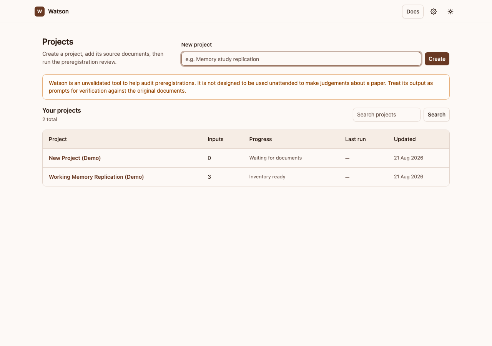

# Watson

!!! warning "Unvalidated assistance tool"
    Watson is an unvalidated tool to help audit preregistrations. It is not designed to be used unattended to make judgements about a paper. Treat its output as prompts for verification against the original documents.

Watson helps you check whether a published study followed its preregistration. You give it the article and the preregistration; it reads both, finds every study inside the article, and tells you what was promised, what was actually done, and where the two disagree.

It runs on your own computer, in your own browser — there is no account, no cloud storage, and no server anyone else can see.



## What it does

For each study that has a matching preregistration, Watson:

1. Reads the preregistration and lists every commitment the researchers made.
2. Reads the article (and any supplemental files) and lists what was actually done.
3. Compares the two lists — what was promised but never reported, what was reported but never promised, and what was done differently than planned.
4. Flags places where the preregistration was written loosely enough that more than one result could have come out of it.

You get all four as a readable report, plus the underlying data if you want to dig further. See [How the preregistration check works](preregistration-check.md) for a walk-through with a worked example.

If you also upload analysis source files, Watson can optionally [audit the code](code-audit.md) against the analyses reported in the manuscript and preregistration. It inspects source text only; it never executes uploaded code or reads raw data.

## What it doesn't do

Watson only sends document text to Google's Gemini model when you explicitly click "Start processing." Nothing is uploaded on launch, on page load, or in the background. Your files, your saved API key, and your results stay on your computer. See [Privacy and API keys](privacy.md) for the full picture.

## Installing Watson

You don't need to know Python, the command line, or anything technical to install or run Watson — the installer sets everything up for you.

**macOS or Linux** — open Terminal and paste:

```sh
curl -fsSL https://raw.githubusercontent.com/shaheedazaad/watson/main/scripts/install.sh | sh
```

**Windows** — open PowerShell and paste:

```powershell
irm https://raw.githubusercontent.com/shaheedazaad/watson/main/scripts/install.ps1 | iex
```

To update later, run the same command again.

## Running it

Once installed, open a terminal and type:

```sh
watson
```

Watson opens your default browser automatically. It only listens on your own computer (`127.0.0.1`), so nothing outside it can reach the app. To stop it, close the terminal window or press `Ctrl+C`.

Next: [Getting started](quickstart.md) walks through creating your first project.
