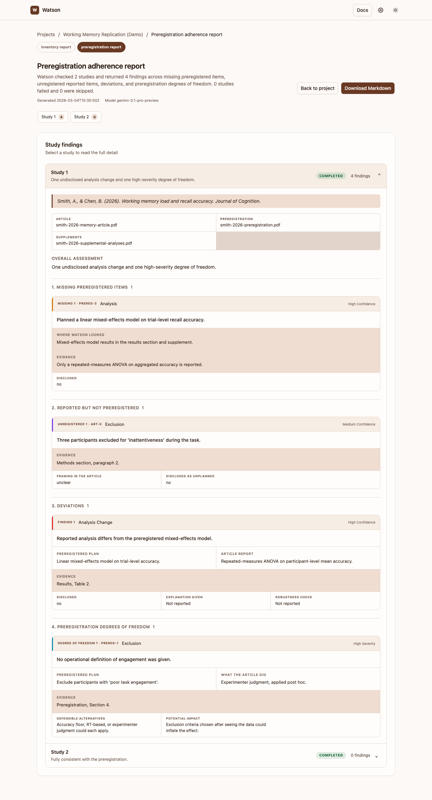

# How the preregistration check works

Watson doesn't ask the model one big question like "did this study deviate from its preregistration?" That kind of question tends to get a vague, hard-to-verify answer. Instead, for each study with a matched preregistration, it runs four separate, narrower passes and shows you the output of each one.

## The four stages

1. **Inventory the preregistration.** Every commitment the researchers made — what they said they would do, how, and how precisely. Each item is tagged as fully specified, partially specified, or unspecified.
2. **Inventory what was done.** Every action the article and its supplemental materials actually report for that study, along with how the article frames it: confirmatory, exploratory, robustness check, or unclear.
3. **Diff the two inventories.** Anything promised but never reported, anything reported but never preregistered, and anything present in both that was executed differently from the plan.
4. **Audit for degrees of freedom.** Commitments that were left open enough that more than one defensible result could have come out of them — regardless of whether the article exploited that flexibility.

The report you read carries all four as separate sections, plus both inventories as appendices, so you can trace any finding back to the specific preregistration item or article passage it came from.

## A worked example

The screenshot below is a sample report — built from a made-up demo study to illustrate the format, not a real check — but its shape and level of detail match what a genuine run produces.

**Study 1** has four findings: one preregistered analysis that was never reported, one exclusion rule applied without being preregistered, one analysis that was run differently than planned, and one degree of freedom (an exclusion criterion — "poor task engagement" — with no stated definition, decided after the fact). Every finding carries the exact wording Watson found, so you can check it against the source document yourself.

**Study 2** has zero findings: it followed its preregistration.

This is the level of detail every check produces — not a single pass/fail verdict, but a traceable list you can read against the source documents yourself.

## Why documents are only uploaded once

Each study's documents are uploaded to Gemini once and held in a shared context cache for all four stages of that study's check, so the article and preregistration text isn't re-sent per request. If the API declines to cache them (this can happen for small documents or under certain conditions), Watson falls back to attaching the documents to each stage individually — the check still runs correctly, just with more data sent.

## What Watson is good at, and what it isn't

Watson is a reading aid, not a verdict. It's good at surfacing discrepancies between two documents quickly and consistently, and at pointing you to the exact wording behind each one. It is not a substitute for reading the study yourself — always check the quoted evidence against the actual document before treating a finding as confirmed, especially for anything you'd cite or act on.
