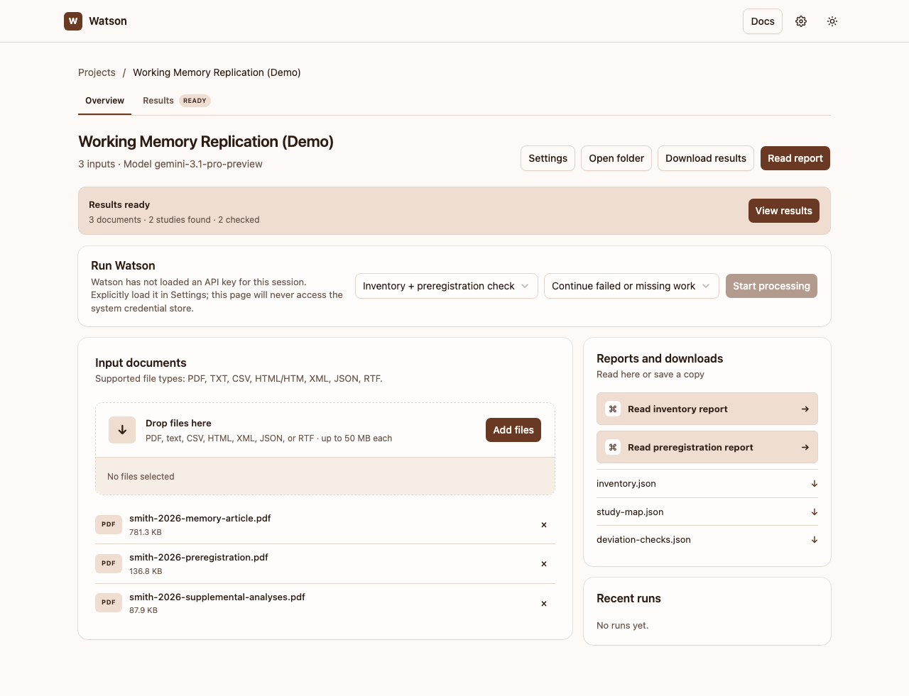
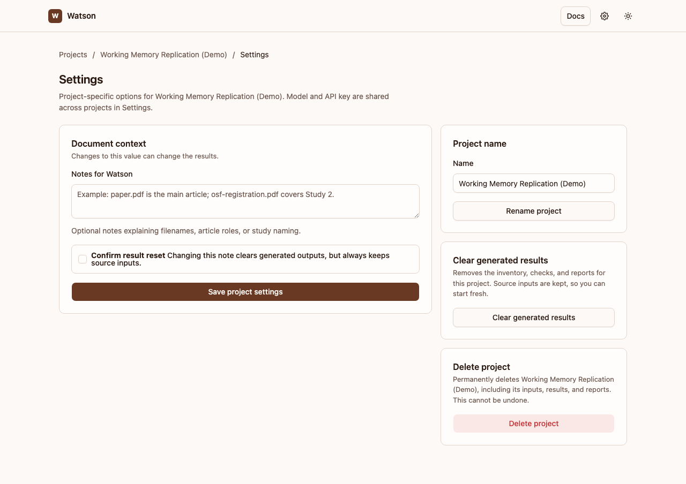
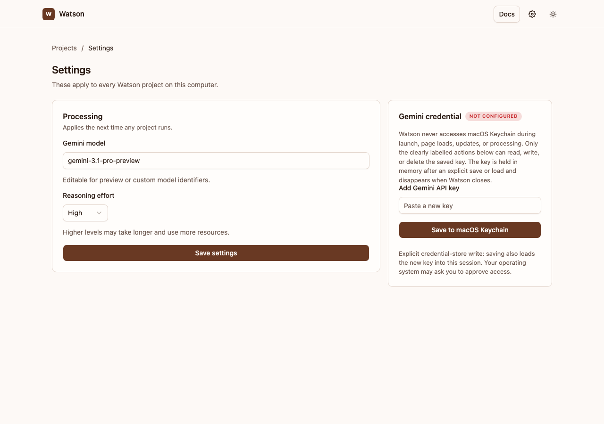
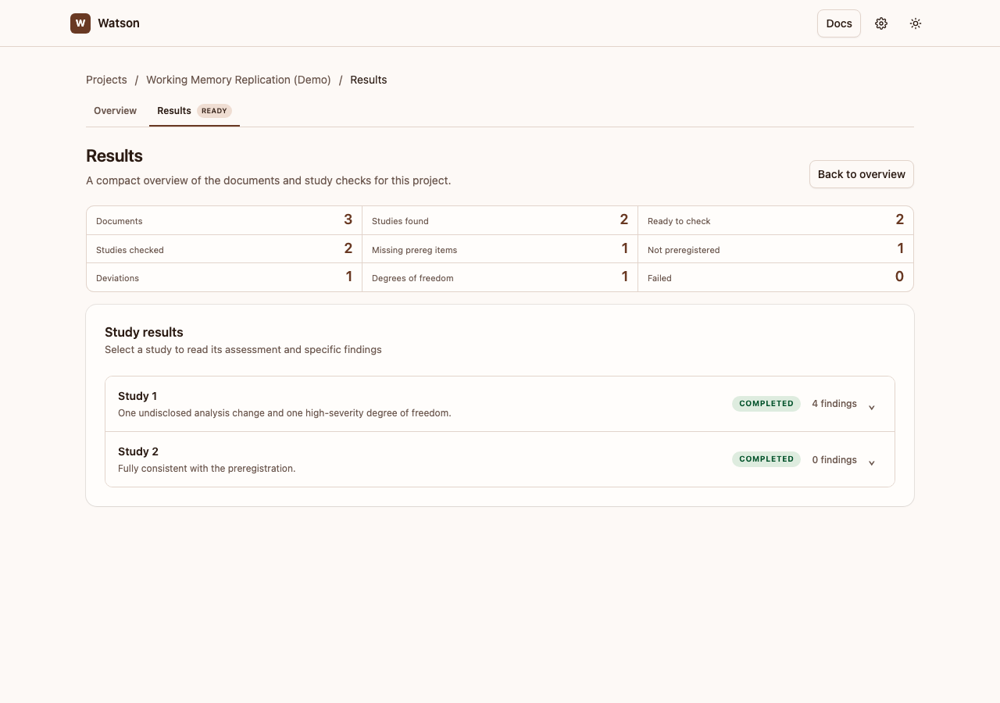
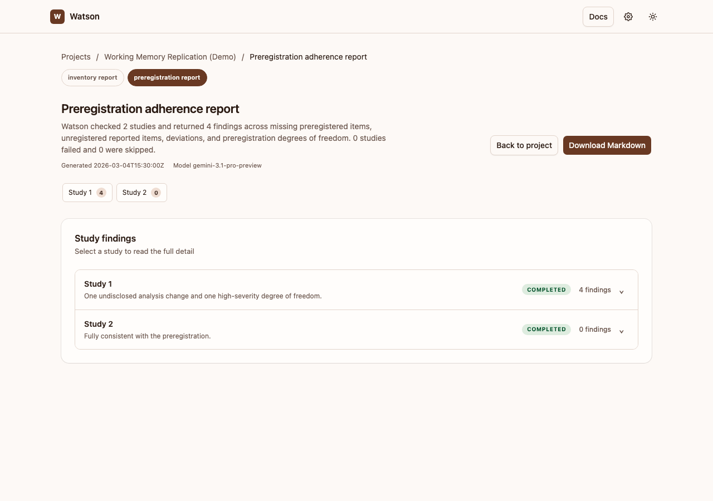

# Getting started

This walks through checking one study, start to finish. It takes about five minutes of your time plus however long Watson needs to read the documents.

!!! note "About the screenshots"
    The screenshots below use a made-up demo study ("Working Memory Replication") to show what each screen looks like — your own project and results will look the same, just with your own file names and findings.

## 1. Install and open Watson

If you haven't installed Watson yet, open a terminal and paste the command for your system.

**macOS or Linux:**

```sh
curl -fsSL https://raw.githubusercontent.com/shaheedazaad/watson/main/scripts/install.sh | sh
```

**Windows:**

```powershell
irm https://raw.githubusercontent.com/shaheedazaad/watson/main/scripts/install.ps1 | iex
```

Then, any time you want to use Watson, open a terminal and type:

```sh
watson
```

Your default browser opens automatically. Watson only listens on your own computer, so nothing outside it can reach the app; close the terminal window or press `Ctrl+C` to stop it. To update later, just run the install command again.

## 2. Create a project

Give your study a name.


A project is just a folder Watson keeps on your computer to hold one study's files, its results, and nothing else. You can make as many as you like — one per paper, one per replication, however you organize your own work.

## 3. Add your documents

Open the project and drop in the files. At minimum you need the article; add the preregistration too so Watson has something to compare it against, and any supplemental materials (analysis code, appendices, extra reporting) that might contain relevant detail.



Watson accepts PDF, TXT, CSV, HTML, XML, JSON, and RTF files, up to 50 MB each.

!!! tip "Ambiguous file names?"
    If your file names don't make each document's role obvious, open the project's own **Settings** and add a note under "Notes for Watson" — for example, which file is the main article and which preregistration covers which study. This can improve accuracy for projects with several studies or files.

    

## 4. Add your Gemini API key (first time only)

Watson uses Google's Gemini model to read your documents, so it needs an API key. Open **Settings** in the top-right corner (not the project's own Settings — this one applies to every project) and paste your key into **Add Gemini API key**.



Click **Save to Keychain** (the button name matches whatever your operating system's credential store is called). This does two things at once: it stores the key securely for next time, and it loads it into memory for your current session — so you're ready to run a check right away. See [Privacy and API keys](privacy.md) for the full explanation of when and how the key is used.

!!! note "If you restart Watson"
    The key stays saved, but each new session starts without it loaded — that's deliberate, so Watson never touches your system credential store on its own. Just come back to this Settings page and click **Load from Keychain**; you won't need to paste the key again.

## 5. Start processing

Back on the project page, choose what to run — usually "Inventory + preregistration check" — and click **Start processing**. You'll see live progress as Watson works through each stage.

This is the only point at which anything leaves your computer: your document text is sent to Gemini for this run, and nothing else.

## 6. Read the results

When it finishes, open **Results** for a summary of every study Watson found, or **Read report** for the full write-up.



Each study expands into its specific findings — missing items, unregistered items, deviations, and degrees of freedom — with the exact wording from both the preregistration and the article, so you can verify Watson's read for yourself.



You can download the full report as Markdown, or download all the underlying data (machine-readable JSON plus the source documents) from the project page.

Next: [The preregistration check](preregistration-check.md) explains what Watson is actually doing at each stage, so you know how much to trust — and how to sanity-check — what it reports.
